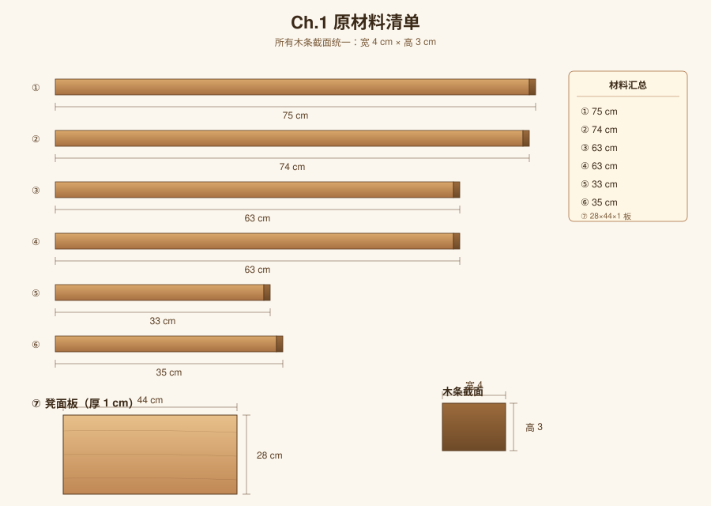
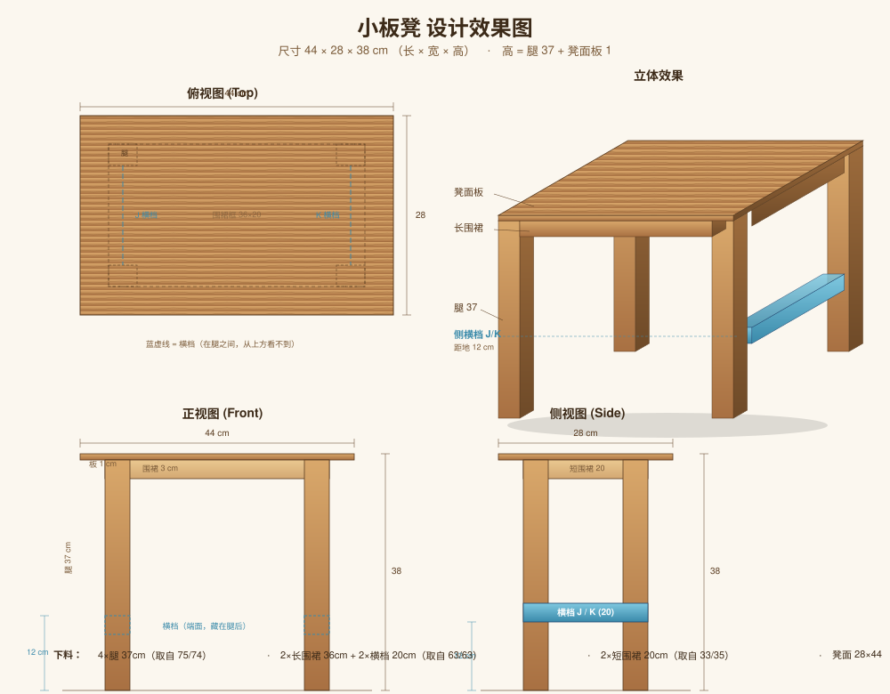
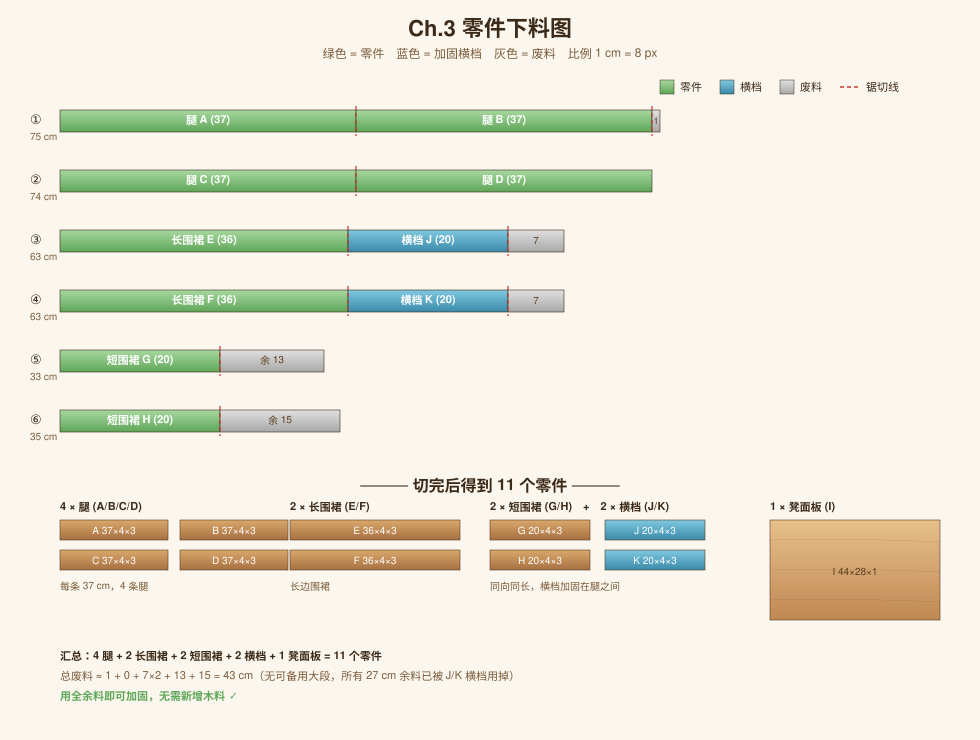
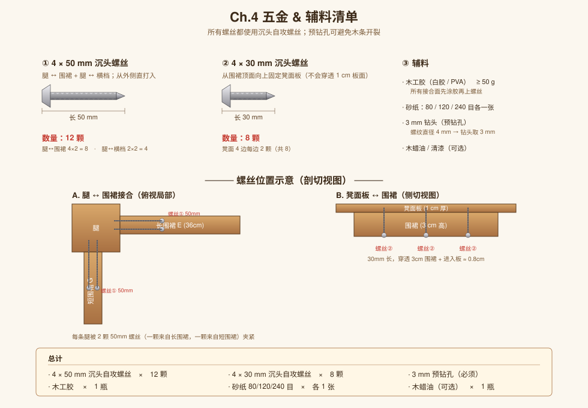
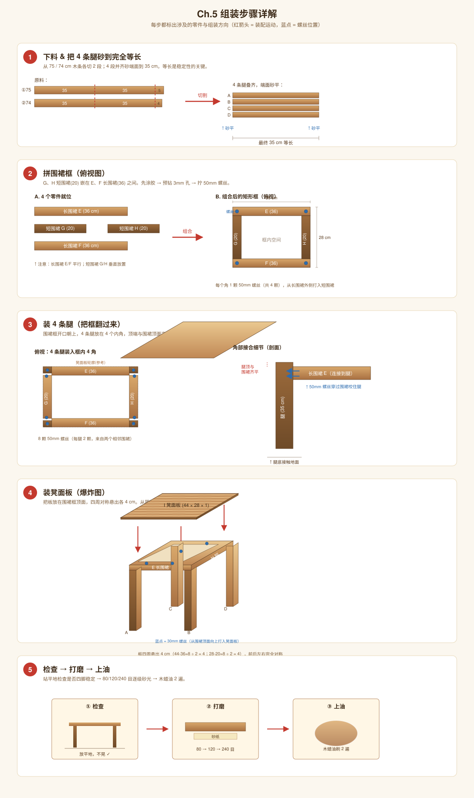
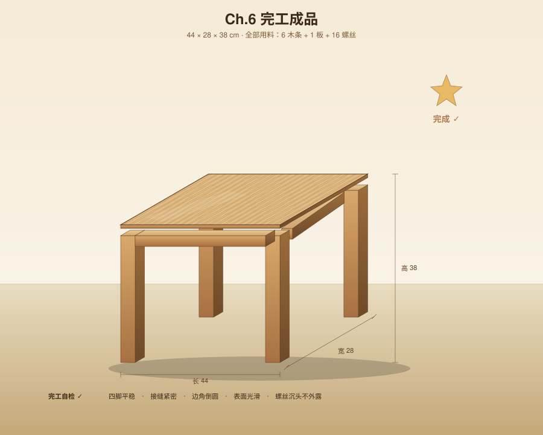

# 小板凳 DIY 制作文档

一个用 6 根木条 + 1 块木板手工制作小板凳的完整指南：从原材料 → 设计 → 下料 → 五金 → 组装 → 完工。

**最终成品**：44 cm × 28 cm × 38 cm 的四腿小板凳

---

## 目录

1. [Ch.1 原材料清单](#ch1-原材料清单)
2. [Ch.2 设计方案](#ch2-设计方案)
3. [Ch.3 零件下料](#ch3-零件下料)
4. [Ch.4 五金 & 辅料](#ch4-五金--辅料)
5. [Ch.5 组装步骤](#ch5-组装步骤)
6. [Ch.6 完工成品](#ch6-完工成品)

---

## Ch.1 原材料清单

### 木条（截面统一 4 cm 宽 × 3 cm 高）

| 编号 | 长度 |
|:---:|:---:|
| ① | 75 cm |
| ② | 74 cm |
| ③ | 63 cm |
| ④ | 63 cm |
| ⑤ | 33 cm |
| ⑥ | 35 cm |

### 木板

| 编号 | 尺寸 |
|:---:|:---:|
| ⑦ | 28 × 44 × 1 cm |

> **观察**：6 根木条可以分成 3 组近似配对 — (75, 74)、(63, 63)、(33, 35)。这是设计的基础。

---

## Ch.2 设计方案

### 设计参数

- **整体尺寸**：长 44 cm × 宽 28 cm × 高 38 cm
- **结构**：四腿 + 矩形围裙框 + 凳面板
- **风格**：传统板凳，简洁实用

### 结构分解

| 部位 | 数量 | 来源 |
|:---:|:---:|:---|
| 凳面板 | 1 | 现成 28×44×1 板 |
| 腿 | 4 | 75 / 74 cm 木条裁切 |
| 长围裙 | 2 | 63 / 63 cm 木条裁切 |
| 短围裙 | 2 | 33 / 35 cm 木条裁切 |

凳面板四周悬出围裙框各 4 cm，对称且美观。

---

## Ch.3 零件下料

### 切割方案

| 原料 | 切割 | 用途 | 废料 |
|:---:|:---|:---|:---:|
| ① 75 cm | 35 + 35 | 腿 A、腿 B | 5 cm |
| ② 74 cm | 35 + 35 | 腿 C、腿 D | 4 cm |
| ③ 63 cm | 36 | 长围裙 E | 27 cm（可留作加固块）|
| ④ 63 cm | 36 | 长围裙 F | 27 cm（可留作加固块）|
| ⑤ 33 cm | 20 | 短围裙 G | 13 cm |
| ⑥ 35 cm | 20 | 短围裙 H | 15 cm |

### 围裙长度计算

- 长围裙：板长 44 − 两腿宽 (4+4) = **36 cm**
- 短围裙：板宽 28 − 两腿宽 (4+4) = **20 cm**

### 最终零件清单

切完后共有 **9 个零件**：

| 编号 | 部件 | 数量 | 尺寸（cm）|
|:---:|:---|:---:|:---:|
| A–D | 腿 | 4 | 35 × 4 × 3 |
| E、F | 长围裙 | 2 | 36 × 4 × 3 |
| G、H | 短围裙 | 2 | 20 × 4 × 3 |
| I | 凳面板 | 1 | 44 × 28 × 1 |

> **重要**：4 条腿切完后必须叠在一起砂端面到完全等长，否则板凳会晃。

---

## Ch.4 五金 & 辅料

### 螺丝

| 规格 | 数量 | 用途 |
|:---|:---:|:---|
| 4 × 50 mm 沉头自攻螺丝 | 8 颗 | 腿 ↔ 围裙连接（每条腿 2 颗）|
| 4 × 30 mm 沉头自攻螺丝 | 8 颗 | 围裙 ↔ 凳面板（每边 2 颗）|

### 辅料

- 木工胶（PVA 白胶）≥ 50 g
- 砂纸 80 / 120 / 240 目 各 1 张
- 3 mm 钻头（预钻孔，避免木条开裂）
- 木蜡油 / 清漆（可选，做表面处理）

### 工具

- 手锯 或 电锯
- 卷尺、铅笔、角尺
- 电钻 + 沉头钻头
- 螺丝刀
- 夹具（有更好）

### 螺丝位置原则

1. **腿 ↔ 围裙**：从围裙外侧打入腿内，深度 50 mm 足够穿透围裙（3 cm）并咬住腿（约 2 cm）
2. **围裙 ↔ 凳面板**：从围裙顶面向上打入板，30 mm 长，穿过 3 cm 围裙后进入板 0.8 cm，**不会穿透 1 cm 板面**

---

## Ch.5 组装步骤

### Step 1：下料 & 找平

按 Ch.3 的方案切出 4 腿 + 2 长围裙 + 2 短围裙。把 4 条腿叠在一起，两端用砂纸找平到完全等长（35 cm）。

> **关键**：4 腿等长直接决定板凳稳定性。

### Step 2：拼围裙框

把 G、H 短围裙嵌在 E、F 长围裙之间，形成内部 36 × 20 cm 的矩形框：

1. 在 E 的两端内侧、H 的两端内侧涂木工胶
2. 用 3 mm 钻头预钻孔
3. 从外侧打入 4 颗 50 mm 螺丝（每个角 1 颗，先不全紧）
4. 用角尺检查四角 90°，再全部拧紧

### Step 3：装腿

把围裙框翻过来（开口朝上），4 条腿插入 4 个内角：

1. 腿顶端与围裙顶面**齐平**
2. 涂胶 → 预钻孔 → 从围裙外侧打入螺丝（每条腿 2 颗，一颗来自长围裙方向，一颗来自短围裙方向）
3. 翻过来站在平地上，目测是否四脚平稳。不平就用砂纸把高的那条腿底部磨低。

### Step 4：装凳面板

把板放在围裙框顶面上：

1. 板四周各悬出 4 cm（44 − 36 = 8，÷2 = 4；28 − 20 = 8，÷2 = 4），左右前后对称
2. 从围裙顶面（即板的反面）向上打 8 颗 30 mm 螺丝
3. 不要先打太紧，全部上好后再依次拧紧

### Step 5：检查 → 打磨 → 上油

1. 放在平地上检查稳定性，必要时砂腿
2. 80 目 → 120 目 → 240 目逐级砂光所有表面，特别是边角倒圆
3. 涂木蜡油或清漆，干透后再涂第二遍

---

## Ch.6 完工成品

### 完工自检清单

- [ ] 四脚平稳，没有晃动
- [ ] 所有接缝紧密无缝隙
- [ ] 角尺测试，框四角 90°
- [ ] 边角倒圆，触感顺滑
- [ ] 表面砂光均匀，无毛刺
- [ ] 所有螺丝沉头不外露
- [ ] 表面油（漆）涂层均匀

### 用料统计

- 6 根木条 → 4 腿 + 4 围裙（废料 91 cm，其中两段 27 cm 可备用）
- 1 块木板 → 凳面（无废料）
- 16 颗螺丝（50 mm × 8 + 30 mm × 8）
- 50 g 木工胶

---

## 附录：常见问题

**Q1：可以不用螺丝吗？**
可以做榫卯版（短围裙开榫嵌入长围裙，腿开槽夹住围裙），但工艺难度高很多，需要凿子和精细测量。

**Q2：木条剩下的 27 cm 怎么用？**
可以做对角加固块（45° 切角，胶在腿与围裙的内夹角处），或者做一根脚踏横档（在两条腿之间）。

**Q3：稳定性不够怎么办？**
最简单的加固：在长围裙下方 10 cm 处加一根横档（用 27 cm 余料），用螺丝固定到两条腿。

---

*Designed & documented with Claude Code · 2026-05*
